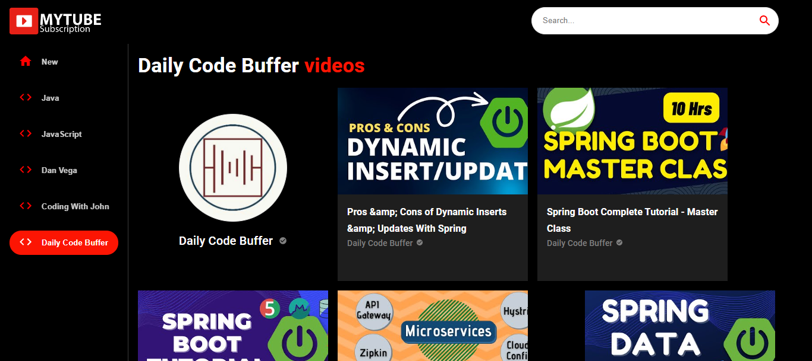
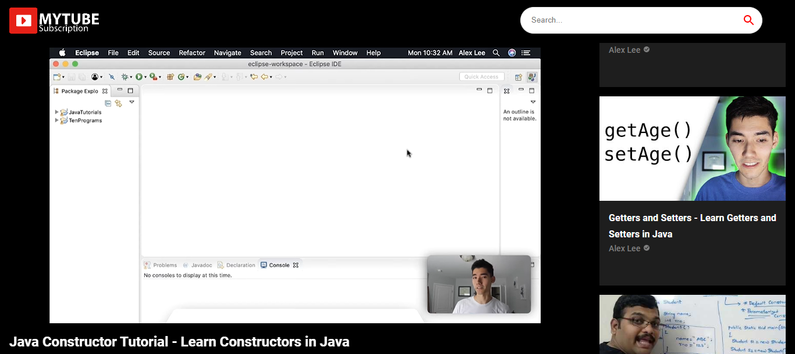

# My Tube

## Description

This is a simple web application that allows users to search for videos on YouTube and save them to a database. Users can also view videos that other users have saved.

## Motivation

```bash
This Project was Inspired by <a href="https://www.youtube.com/watch?v=VPVzx1ZOVuw">Javascript Mastery</a>.
```

## Technology Stack

In this project, I used [ReactJS](https://reactjs.org/), I didn't use any backend because i just grabbed the API from [RapidAPI](https://rapidapi.com/), and i used [Material UI](https://material-ui.com/) for the UI.

## Installation

For the installation, you just need to clone the project and run `npm install` to install all the dependencies.

## Usage

To use the project, you just need to run `npm start` and the project will be running on `localhost:3000`.

## Screenshots

- Home Page  
  
- Video Page  
  

## Contributing

Pull requests are welcome. For major changes, please open an issue first to discuss what you would like to change.

## Credits

- [ivandjoh](https://linkedin.com/in/ivandjoh)
- [delvin](https://github.com/delvincakep)
